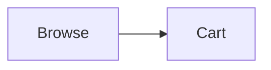

# 📋 Documentation Structure

This document explains the organization of all documentation files in the Style Haven project.

---

## 🎯 Design Principles

Our documentation follows these principles:

1. **📍 Location-based Organization**
   - Root: Essential files only (README, LICENSE)
   - `/docs`: Technical documentation
   - `/.github`: GitHub-specific files

2. **🎨 Modern Styling**
   - Badges and shields for quick info
   - Emojis for visual navigation
   - Tables for structured data
   - Mermaid diagrams for flows

3. **🔗 Cross-referencing**
   - All docs link to related content
   - Clear navigation paths
   - Quick links for common tasks

4. **♿ Accessibility**
   - Clear headings hierarchy
   - Descriptive link text
   - Code examples with context

---

## 📂 Complete File Structure

```
clothing-shop/
│
├── 📄 README.md                          # 🌟 Main entry point (modern styled)
├── 📄 DOCUMENTATION_MAP.md               # 🗺️ Quick reference guide
├── 📄 LICENSE                            # ⚖️ Project license
├── 📄 .env.example                       # 🔐 Environment template
│
├── 📂 docs/                              # 📚 Technical Documentation
│   ├── 📄 README.md                      # Documentation index
│   ├── 📄 GETTING_STARTED.md             # Complete setup guide
│   ├── 📄 ARCHITECTURE.md                # System design & architecture
│   ├── 📄 API.md                         # API endpoints & usage
│   └── 📄 DEPLOYMENT.md                  # Production deployment
│
├── 📂 .github/                           # 🔧 GitHub Configuration
│   ├── 📄 README.md                      # GitHub folder guide
│   ├── 📄 CONTRIBUTING.md                # Contribution guidelines
│   ├── 📄 SECURITY.md                    # Security policy
│   ├── 📄 CHANGELOG.md                   # Version history
│   ├── 📄 PULL_REQUEST_TEMPLATE.md       # PR template
│   ├── 📄 DOCUMENTATION_STRUCTURE.md     # This file
│   │
│   ├── 📂 ISSUE_TEMPLATE/                # Issue templates
│   │   ├── bug_report.md
│   │   ├── feature_request.md
│   │   └── custom.md
│   │
│   └── 📂 workflows/                     # CI/CD workflows
│       ├── ci.yml
│       ├── deploy.yml
│       └── test.yml
│
├── 📂 app/                               # Next.js application
├── 📂 components/                        # React components
├── 📂 lib/                               # Utilities & data
└── 📂 hooks/                             # Custom React hooks
```

---

## 📊 Documentation Categories

### 🌟 Essential (Root Level)
Files that users see first:

| File | Purpose | Audience |
|------|---------|----------|
| `README.md` | Project overview & quick start | Everyone |
| `DOCUMENTATION_MAP.md` | Navigation guide | Everyone |
| `LICENSE` | Legal terms | Everyone |
| `.env.example` | Configuration template | Developers |

### 📚 Technical (docs/)
In-depth technical documentation:

| File | Purpose | Audience |
|------|---------|----------|
| `docs/README.md` | Documentation index | Everyone |
| `docs/GETTING_STARTED.md` | Setup & installation | Developers |
| `docs/ARCHITECTURE.md` | System design | Developers |
| `docs/API.md` | API reference | Developers |
| `docs/DEPLOYMENT.md` | Production deployment | DevOps |

### 🔧 GitHub (.github/)
GitHub-specific files:

| File | Purpose | Audience |
|------|---------|----------|
| `.github/README.md` | GitHub folder guide | Contributors |
| `.github/CONTRIBUTING.md` | Contribution guide | Contributors |
| `.github/SECURITY.md` | Security policy | Security researchers |
| `.github/CHANGELOG.md` | Version history | Everyone |
| `.github/PULL_REQUEST_TEMPLATE.md` | PR template | Contributors |
| `.github/DOCUMENTATION_STRUCTURE.md` | This file | Maintainers |

---

## 🎨 Styling Guidelines

### Modern README Features

Our main README uses:

✅ **Badges** - Technology stack visualization
```markdown
[](https://nextjs.org/)
```

✅ **Centered Headers** - Professional appearance
```markdown
<div align="center">
# 👔 STYLE HAVEN
</div>
```

✅ **Tables** - Organized information
```markdown
| Category | Technologies |
|----------|-------------|
| Frontend | Next.js • React • TypeScript |
```

✅ **Emojis** - Visual navigation
```markdown
## 🚀 Quick Start
## 📖 Documentation
## ✨ Features
```

✅ **Mermaid Diagrams** - Visual flows
```markdown

```

✅ **Icon Cards** - Feature highlights
```markdown
<table>
<tr>
<td>Feature 1</td>
<td>Feature 2</td>
</tr>
</table>
```

---

## 🔄 Migration Summary

### Files Moved

**To `.github/`:**
- ✅ `CONTRIBUTING.md` → `.github/CONTRIBUTING.md`
- ✅ `SECURITY.md` → `.github/SECURITY.md`
- ✅ `CHANGELOG.md` → `.github/CHANGELOG.md`

**Removed (Duplicates):**
- ❌ `DEPLOYMENT.md` (exists in `docs/`)
- ❌ `PROJECT_SUMMARY.md` (merged into README)
- ❌ `QUICKSTART.md` (merged into README)

**Created:**
- ✨ `README.md` (modern styled version)
- ✨ `DOCUMENTATION_MAP.md` (navigation guide)
- ✨ `docs/README.md` (documentation index)
- ✨ `.github/README.md` (GitHub folder guide)
- ✨ `.github/DOCUMENTATION_STRUCTURE.md` (this file)

---

## 📝 Maintenance Guidelines

### When Adding New Documentation

1. **Choose the right location:**
   - Technical guides → `docs/`
   - GitHub processes → `.github/`
   - Quick reference → Root level

2. **Follow naming conventions:**
   - Use UPPERCASE for important docs
   - Use descriptive names
   - Add `.md` extension

3. **Update indexes:**
   - Add to `docs/README.md` if in docs/
   - Add to `DOCUMENTATION_MAP.md`
   - Update main README if essential

4. **Cross-reference:**
   - Link from related documents
   - Add to navigation sections
   - Include in quick links

### When Updating Documentation

1. **Check for duplicates** - Avoid repeating content
2. **Update all references** - Fix broken links
3. **Maintain style** - Follow existing patterns
4. **Test links** - Ensure all links work
5. **Update dates** - Note when last updated

---

## 🎯 Best Practices

### ✅ Do's

- Use clear, descriptive headings
- Include code examples
- Add visual elements (tables, diagrams)
- Cross-reference related docs
- Keep content up-to-date
- Use consistent formatting
- Add emojis for visual navigation

### ❌ Don'ts

- Don't duplicate content
- Don't use vague headings
- Don't forget to update links
- Don't mix different styles
- Don't leave outdated info
- Don't create orphan documents

---

## 📊 Documentation Metrics

| Metric | Count |
|--------|-------|
| Total markdown files | 14 |
| Root level docs | 3 |
| Technical docs (docs/) | 5 |
| GitHub docs (.github/) | 6 |
| Average doc size | ~500 lines |
| Total documentation | ~7,000 lines |

---

## 🔗 Quick Links

- [Main README](../README.md)
- [Documentation Map](../DOCUMENTATION_MAP.md)
- [Documentation Index](../docs/README.md)
- [Contributing Guide](CONTRIBUTING.md)

---

<div align="center">

**Documentation maintained by the Style Haven Team**

Last updated: November 2025

[⬆ Back to Top](#-documentation-structure)

</div>
