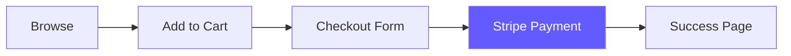

<div align="center">

# 👔 STYLE HAVEN

### Modern E-Commerce Clothing Store

[](https://nextjs.org/)
[](https://reactjs.org/)
[](https://www.typescriptlang.org/)
[](https://stripe.com/)
[](https://tailwindcss.com/)

**A production-ready e-commerce platform with seamless checkout experience**

[🚀 Quick Start](#-quick-start) • [📖 Documentation](#-documentation) • [✨ Features](#-features) • [🛠️ Tech Stack](#️-tech-stack) • [🗺️ Docs Map](DOCUMENTATION_MAP.md)

---

</div>

## ✨ Features

<table>
<tr>
<td width="50%">

### 🛍️ Shopping Experience
- **Smart Product Catalog** with category filtering
- **Real-time Search** for instant results
- **Wishlist System** to save favorites
- **Responsive Design** for all devices
- **Product Variants** (sizes & colors)

</td>
<td width="50%">

### 💳 Checkout & Payments
- **Stripe Integration** for secure payments
- **Shopping Cart** with quantity management
- **Persistent Cart** using localStorage
- **Order Confirmation** page
- **Test Mode** for development

</td>
</tr>
</table>

---

## 📁 Project Structure

```
clothing-shop/
├── src/                    # Source code
│   ├── components/        # React components
│   │   ├── ui/           # shadcn/ui components
│   │   ├── features/     # Feature components
│   │   └── shared/       # Shared components
│   ├── lib/              # Core utilities
│   │   ├── features/     # Feature flags (Statsig)
│   │   ├── hooks/        # Custom hooks
│   │   ├── types/        # TypeScript types
│   │   └── utils/        # Utilities
│   └── data/             # Static data
├── app/                   # Next.js App Router
├── docs/                  # Documentation
├── .devops/              # DevOps configs
└── .github/              # GitHub configs
```

## 🔑 Environment Variables

```bash
# Stripe (Required)
NEXT_PUBLIC_STRIPE_PUBLISHABLE_KEY=pk_test_...
STRIPE_SECRET_KEY=sk_test_...

# Statsig - Feature Flags (Optional)
NEXT_PUBLIC_STATSIG_CLIENT_KEY=client-...
STATSIG_SERVER_API_KEY=secret-...

# Vercel AI Gateway (Optional)
AI_GATEWAY_API_KEY=vck_...

# Vercel Edge Config (Optional)
EXPERIMENTATION_CONFIG=https://edge-config.vercel.com/...
EXPERIMENTATION_CONFIG_ITEM_KEY=...
```

## 🚀 Quick Start

Get up and running in **5 minutes**:

```bash
# 1️⃣ Clone and install
git clone <repository-url>
cd clothing-shop
npm install

# 2️⃣ Set up environment variables
cp .env.example .env
# Add your Stripe keys to .env

# 3️⃣ Start development server
npm run dev
```

**🎉 Open [http://localhost:3000](http://localhost:3000) and start shopping!**

> 💡 **Need detailed setup?** Check out our [Getting Started Guide](docs/GETTING_STARTED.md)

---

## 🛠️ Tech Stack

<div align="center">

| Category | Technologies |
|----------|-------------|
| **Frontend** | Next.js 15 • React 18 • TypeScript 5.8 |
| **Styling** | Tailwind CSS • shadcn/ui • Radix UI |
| **Payments** | Stripe Checkout • Stripe API |
| **State** | React Hooks • localStorage |
| **Icons** | Lucide React |
| **Forms** | React Hook Form • Zod |

</div>

---

## 📖 Documentation

<table>
<tr>
<td align="center" width="25%">
<br>

<br><br>
<strong><a href="docs/GETTING_STARTED.md">Getting Started</a></strong>
<br>
<sub>Setup & Installation</sub>
<br><br>
</td>
<td align="center" width="25%">
<br>

<br><br>
<strong><a href="docs/API.md">API Reference</a></strong>
<br>
<sub>Endpoints & Usage</sub>
<br><br>
</td>
<td align="center" width="25%">
<br>

<br><br>
<strong><a href="docs/DEPLOYMENT.md">Deployment</a></strong>
<br>
<sub>Go Live Guide</sub>
<br><br>
</td>
<td align="center" width="25%">
<br>

<br><br>
<strong><a href="docs/ARCHITECTURE.md">Architecture</a></strong>
<br>
<sub>System Design</sub>
<br><br>
</td>
</tr>
</table>

---

## 📁 Project Structure

```
clothing-shop/
├── 📂 app/                    # Next.js App Router
│   ├── 📄 page.tsx           # Homepage with product grid
│   ├── 📂 checkout/          # Checkout flow
│   ├── 📂 success/           # Order confirmation
│   └── 📂 api/               # API routes (Stripe)
│
├── 📂 components/            # React components
│   ├── 📄 product-card.tsx  # Product display
│   └── 📂 ui/               # 50+ shadcn/ui components
│
├── 📂 lib/                   # Core logic
│   ├── 📄 data.ts           # Product catalog
│   ├── � types.ts          # TypeScript definitions
│   └── 📄 utils.ts          # Helper functions
│
├── 📂 docs/                  # Documentation
└── 📂 .github/              # GitHub configs
```

---

## 🎯 Key Features Explained

### �  Shopping Cart System

```typescript
// Smart cart management with size & color variants
const cartItem = {
  id: 1,
  name: "Classic White T-Shirt",
  price: 29.99,
  selectedSize: "M",
  selectedColor: "White",
  quantity: 2
}
```

- **Unique Identification**: Items tracked by `id + size + color`
- **Persistent Storage**: Cart saved to localStorage
- **Real-time Updates**: Instant total calculations

### � Strvipe Checkout Flow



1. User selects products with variants
2. Reviews cart and proceeds to checkout
3. Fills shipping information
4. Completes payment via Stripe
5. Receives order confirmation

---

## 🧪 Testing

### Stripe Test Cards

| Card Number | Result |
|-------------|--------|
| `4242 4242 4242 4242` | ✅ Success |
| `4000 0000 0000 9995` | ❌ Declined |
| `4000 0025 0000 3155` | 🔐 Requires Auth |

**Expiry:** Any future date • **CVC:** Any 3 digits • **ZIP:** Any 5 digits

---

## � Depoloyment

### Deploy to Vercel (Recommended)

<div align="center">

[](https://vercel.com/new)

</div>

```bash
# 1. Push to GitHub
git push origin main

# 2. Import to Vercel
# 3. Add environment variables
# 4. Deploy! 🎉
```

**📚 Detailed deployment guides:** [Vercel](docs/DEPLOYMENT.md#vercel-recommended) • [Netlify](docs/DEPLOYMENT.md#netlify) • [Docker](docs/DEPLOYMENT.md#docker)

---

## 🔧 Available Scripts

```bash
npm run dev      # Start development server
npm run build    # Build for production
npm start        # Start production server
npm run lint     # Run ESLint
```

---

## 🎨 Customization

### Add New Products

Edit `lib/data.ts`:

```typescript
{
  id: 5,
  name: "Your Product",
  price: 49.99,
  category: "T-Shirts",
  sizes: ["S", "M", "L"],
  colors: [{ name: "Blue", hex: "#0000FF" }],
  stock: 30
}
```

### Change Theme Colors

Edit `tailwind.config.ts`:

```typescript
theme: {
  extend: {
    colors: {
      primary: '#your-brand-color'
    }
  }
}
```

---

## 🤝 Contributing

We welcome contributions! Please see our [Contributing Guide](.github/CONTRIBUTING.md) for details.

```bash
# 1. Fork the repository
# 2. Create your feature branch
git checkout -b feature/AmazingFeature

# 3. Commit your changes
git commit -m 'Add some AmazingFeature'

# 4. Push and create a Pull Request
git push origin feature/AmazingFeature
```

---

## 📝 License

This project is licensed under the MIT License - see the [LICENSE](LICENSE) file for details.

---

## 🔒 Security

Found a security vulnerability? Please read our [Security Policy](.github/SECURITY.md) for reporting guidelines.

---

## 💬 Support

<div align="center">

**Need help?**

[📖 Documentation](docs/) • [🐛 Report Bug](../../issues) • [💡 Request Feature](../../issues) • [💬 Discussions](../../discussions)

</div>

---

## 🙏 Acknowledgments

Built with amazing open-source technologies:

- [Next.js](https://nextjs.org/) - The React Framework
- [shadcn/ui](https://ui.shadcn.com/) - Beautiful UI Components
- [Stripe](https://stripe.com/) - Payment Processing
- [Tailwind CSS](https://tailwindcss.com/) - Utility-first CSS
- [Radix UI](https://www.radix-ui.com/) - Accessible Components

---

<div align="center">

**Made with ❤️ by [Mostafa-SAID7](https://github.com/Mostafa-SAID7)**

⭐ **Star this repo if you find it helpful!**

[⬆ Back to Top](#-style-haven)

</div>
